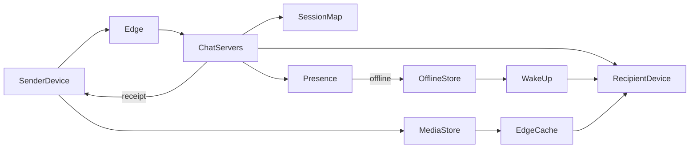
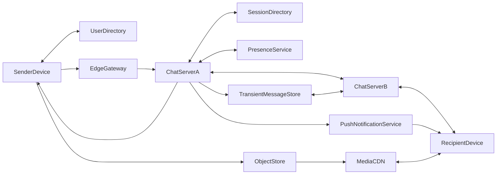
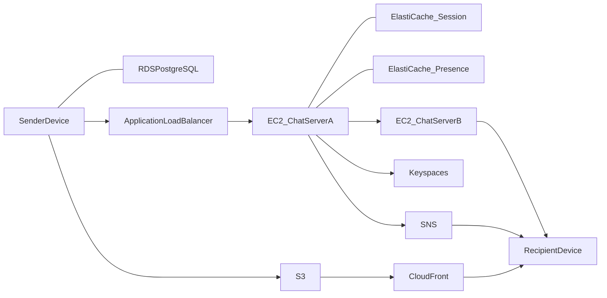

# Architecture and design

Version 1.3.0 · 2026-10-04

This document describes the messaging system the simulation teaches, and how the page itself is built. The running page is not that messaging system. It replays scripted hops in the browser.

## Conceptual architecture

People and responsibilities, with no products and no data formats.

The sender’s device protects the message and hands ciphertext to the edge. The edge owns the connection, not the contents. Chat servers hold the open sockets and decide where a frame goes. A session map says which server holds a person. Presence says whether that person is online. If they are, the recipient’s chat server pushes the frame down the existing socket. If they are not, a short-lived store holds the ciphertext and a wake-up asks the phone to reconnect. The recipient’s device decrypts, keeps the history, and sends a receipt back so the servers can forget the message. Photos are not frames: the bytes live in a media store and an edge cache, and the chat path carries only a pointer and a wrapped key.

## Logical architecture

Services, stores, and the data each one sees.

| Component | Responsibility | What it holds |
| --- | --- | --- |
| Sender Device | Encrypt, local outbox, apply the receipt | Plaintext and ciphertext |
| User Directory | Resolve phone number to user id and identity key | Profile row |
| Edge Gateway | Terminate TLS and forward WebSocket frames | Connection id, ciphertext frame |
| Chat Server A | Own the sender socket, route, park or forward | In-flight frame |
| Session Directory | Map user id to the server holding the socket | `userId → server`, short TTL |
| Presence Service | Online or offline | Status and last seen |
| Chat Server B | Own the recipient socket, deliver, relay receipts | In-flight frame |
| Transient Message Store | Ciphertext until the phone acks | Row deleted on delivery |
| Push Notification Service | Wake the device with no message body | Device token, message id |
| Recipient Device | Decrypt, local history, send the receipt | Plaintext |
| Object Store | Immutable ciphertext blobs | Bytes, no key |
| Media CDN | Cache those blobs | Ciphertext, no key |

Two arrows in the simulation mean a logical exchange in both directions: directory lookup, session lookup, presence lookup, forwarding and the receipt between the chat servers, delivery and the receipt with the phone, read and delete of the transient store, and the CDN fetch.

### Walks

Online text. Directory, encrypt, gateway, Chat Server A, session, presence online, Chat Server B, decrypt, receipt back, transient store left empty.

Offline text. The same path until presence is offline. Then write the transient store, push with an empty body, reconnect, read, deliver, receipt, delete the row.

Photo. Encrypt the bytes on the device, store ciphertext, cache it. The chat frame carries the object location and wrapped key. The CDN fetch does not include the key. The recipient decrypts locally.

## Physical architecture

The roles stay fixed. The product under each role changes with the provider. Devices are not cloud services.

The diagram above is the AWS shape. Azure and Google use the same boxes:

- User Directory: Amazon RDS for PostgreSQL, Azure Database for PostgreSQL, Cloud SQL for PostgreSQL.
- Edge Gateway: Application Load Balancer, Azure Application Gateway, Cloud Load Balancing.
- Chat servers: Amazon EC2, Azure Virtual Machines, Compute Engine.
- Session and presence: Amazon ElastiCache for Redis, Azure Cache for Redis, Memorystore for Redis.
- Transient store: Amazon Keyspaces, Azure Cosmos DB for Apache Cassandra, Bigtable. Google has no managed Cassandra, so Bigtable is the wide-column counterpart.
- Push: Amazon SNS, Azure Notification Hubs, Firebase Cloud Messaging.
- Object store: Amazon S3, Azure Blob Storage, Cloud Storage.
- Media CDN: Amazon CloudFront, Azure Front Door, Cloud CDN.

## Simulation design

The page is a Vite React app. `src/simulation/scenarios.ts` is an ordered list of hops. `projectWalk` rebuilds chat state and the payload text boxes from the hops up to the current index, so step back is exact. `src/simulation/flow.ts` places the symbols and decides which arrow a hop lights. Cloud choice only changes product names and resource strings inside payloads.

Payloads are illustrative JSON. There is no socket, database, or object store.

## Decisions carried into the simulation

- Ciphertext on the wire, plaintext only on the phones.
- Stateful chat servers, because something must hold the socket.
- A memory map for session and presence, separate from the user directory.
- Offline messages deleted after delivery.
- Media bytes off the chat socket, key off the CDN.

## Version history

- **1.3.0** (2026-10-04). This document, including the conceptual, logical, and physical diagrams. On-page summary and version history.
- **1.2.0** (2026-10-04). Purpose added as a third reading of each component, beside the payload and the tradeoff.
- **1.1.0** (2026-10-04). Logical flow drawn as symbols and arrows. Two arrows where the logical exchange is both ways. Data and Why this choice open on click.
- **1.0.0** (2026-10-04). Scripted hops for the three walks, cloud product labels, and the tradeoff text.
